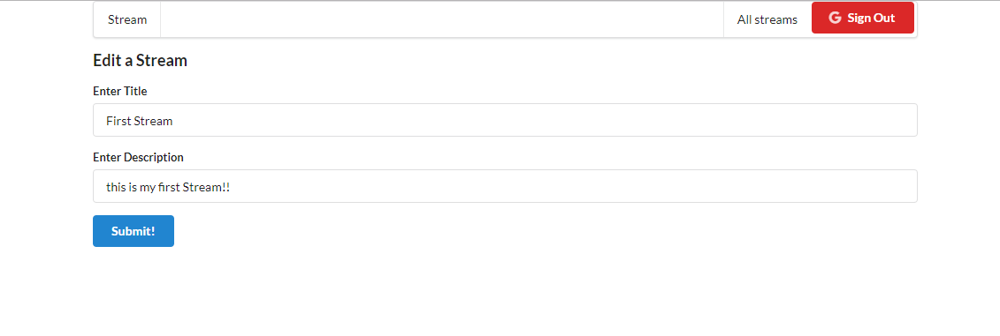
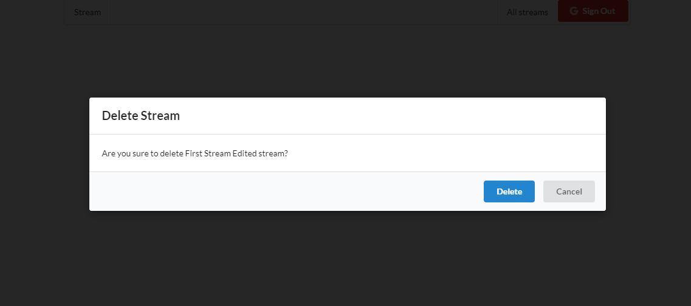
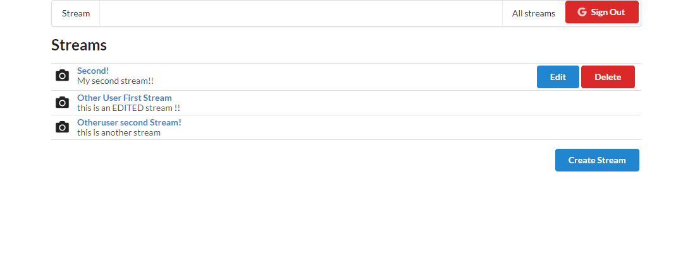

This is an app from an Udemy course, implements React , Redux, Redux Thunk, Redux Form, Router, Router DOM, Google Auth, and is a Boilerplate for a CRUD App!

Uses a "mock Api" with json-server

in order this to work, you can init an npm project replace the entire package.json with this:

```
{
  "name": "api",
  "version": "1.0.0",
  "description": "",
  "main": "index.js",
  "scripts": {
    "start": "json-server -p 3001 -w db.json"
  },
  "author": "",
  "license": "ISC",
  "dependencies": {
    "json-server": "^0.15.1"
  }
}
```

and then installed it!






